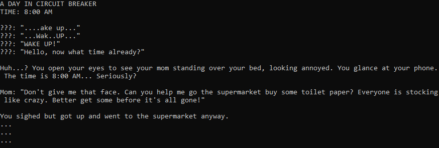
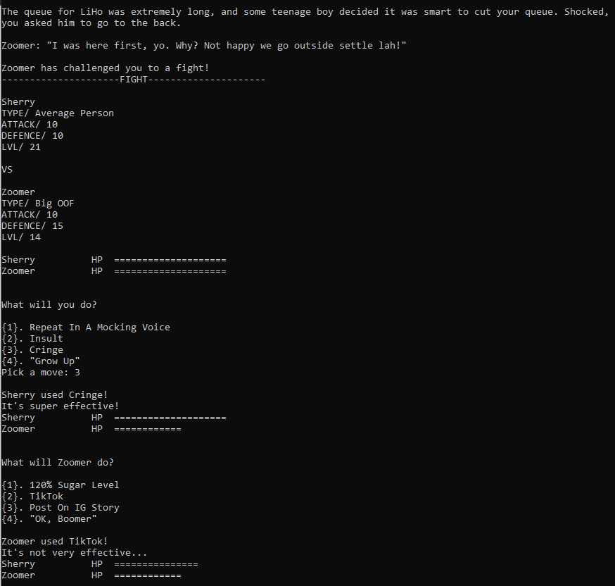
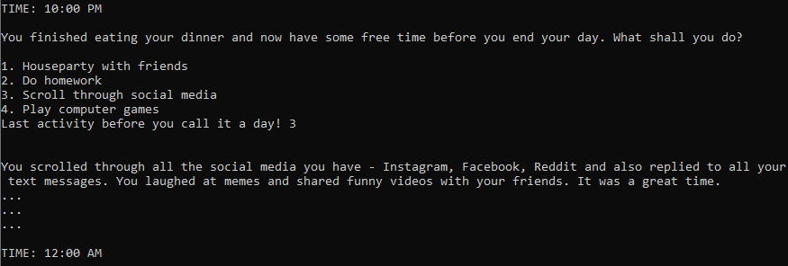

# Project CB
## About
Project CB is a choose-your-own-adventure text-based RPG game based on the COVID-19 pandemic in Singapore in 2020. The game title is derived from when the government announced the first lockdown named 'Circuit Breaker'. In this game, you play through a day in the life of a student during CB, attempting to balance your school-life ratio. There are elements throughout the game that are reminiscent of events that occurred following the lockdown announcement, for eg. panic buying, closure of popular stores and online classes to name a few. Note that the decisions you make influence your happiness, health and grades throughout the game!

Project CB was developed as a project for 10.009 The Digital World.

Developed with:
* Python

## Features
* Pokémon-style battles
* Hidden stats (Happiness, Health, Grades)
* Choices and battle outcomes influence hidden stats

## Screenshots

  

  

  

## Release
Final, working version under **Releases**.

## Known Bugs and Issues
No known bugs and issues.
